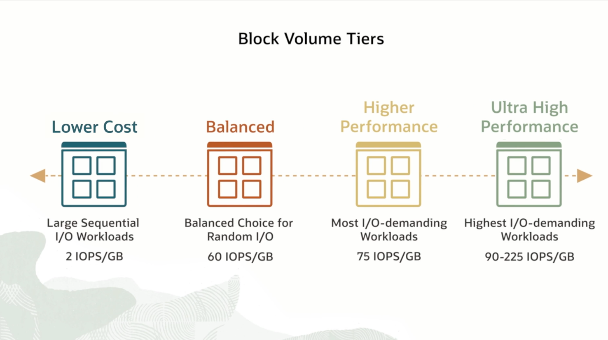
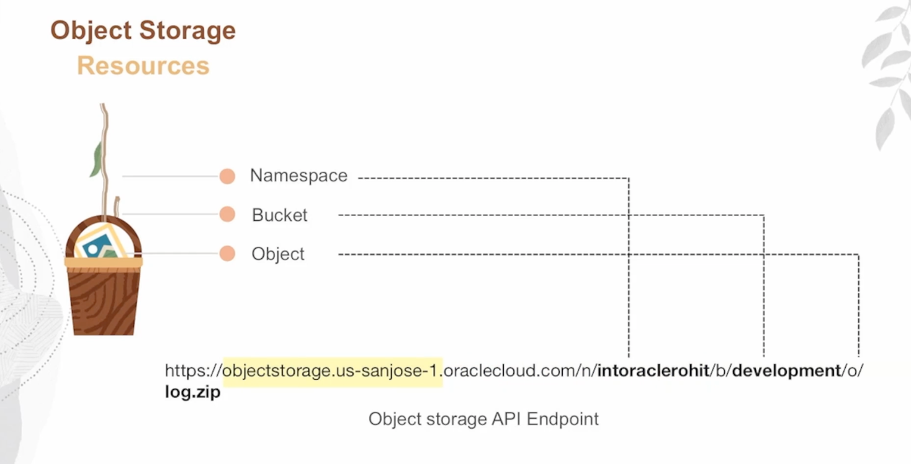

== Storage Services==

# Local NVME
AD level  LOCAL

# Block Volime
AD level  network storage

- Replication is possible

# FILE  storage
AD Level Shared storage

# Object Storage
Object storage

 - Standart
 - Infrequent (60% cheaper)
 - Archive 
 - Auto-ties (automatically from Standart to Infrequent)

=Data Migration=
# Disk

# Appliance

# Storage  Gateway
Linux in your DC in order  to migrate

