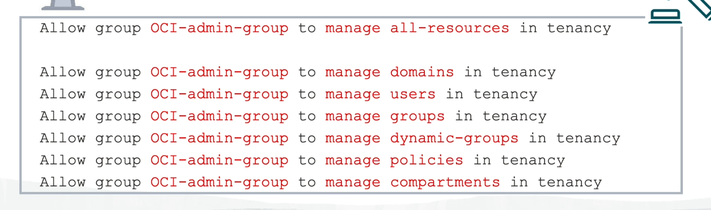

# oci-cource
Oracle Cloud Infrastructure Foundations

# IAM
AuthN - who are you
Login-password or ssh key or tokens

AuthZ - waht  permission  do you have (all denied by default)
Policies  - permision setting  can be ammlied to tenancy(global) or to Compartment
Can be assigned ON a Group level NOT USERS. 

levels:
manage = all perm
use    = read
read = inspect
inspect  - only list resources

OCID - Oracle cloud ID

# Compartment
A container for your resources. It is a virtual space in which you can organize and control access to all of the related resources that make up an
Compartments  are GLOBAL
Compartment tree can be 6 levels
You  can  set Quota and Budget limit on Compartment

# Ident Domains
Identity Domain is a regional entity. in lives inside Compartment

Policies OCI Admin group (in order to them to  be as admin)

